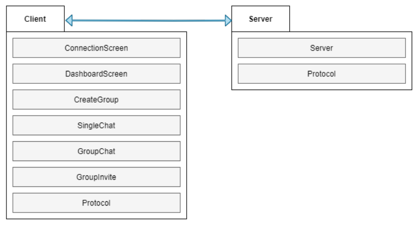

# Python TLS Chat

A secured chatting application, implemented using Python, PyQt, and mechanisms of *Sockets* and *Public Key Cryptography*. 

## Functionality

- The application consists of a client-side graphical user interface (which is used to send messages to other clients), and a server that propagates messages , using socket management.
- PyQT is used for producing the graphical user interface.
- Clients can create chatting groups and invite their friends to join.
- Clients can communicate with others, either by direct messaging or joining an existing group.
- Communication between clients is fully encrypted using *public key cryptography*, so the messages cannot be intercepted and interpretted by attackers.

## Instructions

1. Firstly, install the PyQT dependency (*required for the graphical user interface*).

```
pip3 install PyQt5
```

2. Run the server, using the command below.

```
cd server
python3 Server.py
```

3. Run the client application, using the command below.

```
cd client
python3 Entrypoint.py
```

## Software Architecture

### Package Diagram



### Context Diagram


## Screenshots


